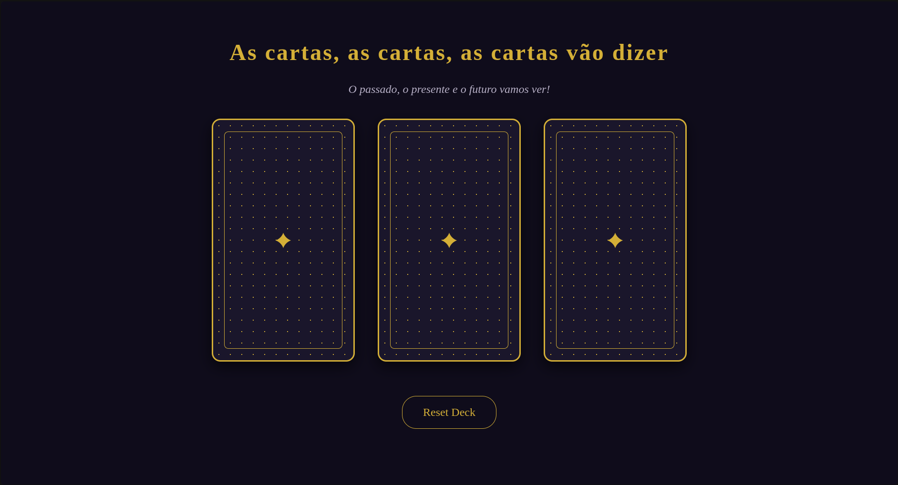
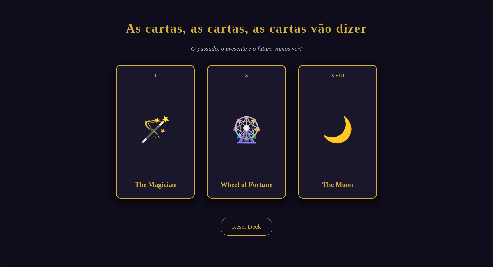

# 🔮 Leitura de Cartas Tarot - Arcanos Maiores

Este é um projeto web interativo desenvolvido durante o programa **Transforme-se**. A aplicação apresenta três cartas de Tarot na tela e permite ao usuário revelar cartas dos Arcanos Maiores com uma animação em 3D ao clicar em cada uma delas.

O objetivo desse projeto foi o aprendizado dos métodos Math no Javascript e preserve-3d no CSS

---

### 🚀 Tecnologias Utilizadas

* **HTML5:** Estruturação semântica e acessível da página.
* **CSS3:** Design visual escuro/místico, layout responsivo e animações 3D de rotação (`perspective`, `transform-style: preserve-3d`, `rotateY`).
* **JavaScript:** Lógica de sorteio aleatório de cartas (evitando duplicatas na mesma leitura) e controle de estado do DOM.

